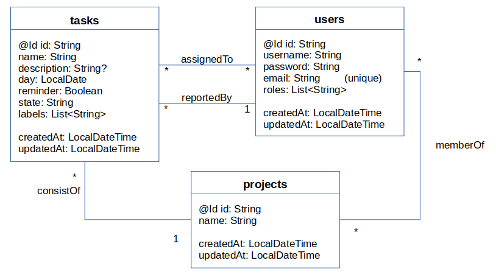
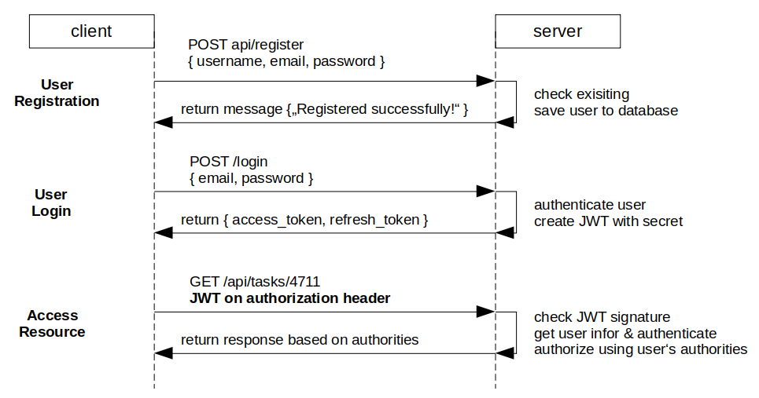

# Task Tracker Backend
This project implements a REST API server that manages tasks for a task's tracker system.
The tasks are stored in a mariadb database. 

## Usage
Build the application with gradle:

    ./mvnw clean build

Run the application:

    ./mvnw bootrun

## Definitions

### Data definition
#### Data model
The data model consists of three main entities: tasks, users and projects. 
Each project consists of zero or more tasks. Each task can be assigned only to 
one project. 

The user that creates a task is its reporter. A task can only 
be reported by exactly one user. The user that reports the task can assign
other users to the task. One task can be assigned to zero or more 
users. A user can be member of zero or more projects.  
 

### REST API
#### Endpoints for authentication
The following table shows the operations that affect the user authentication.

| Method | URL                | Action                                                 |
|--------|--------------------|--------------------------------------------------------|
| POST   | /api/auth/login    | sign in with email and password                        |
| GET    | /api/auth/me       | returns the current logged in user                     |
| POST   | /api/auth/register | register new user with name, email and password (TODO) |

After /register the user must sign in via the /login request.
The response of the /login request contains the user details and two tokens: an access token for
authorization the access to the resources, and a refresh token to renew the access token if it is expired.
The token must be sent in the authorization header as Bearer Token.

#### Endpoints for user management
The following table shows the operations that affect the user management. These operations 
can only perform by admins.

| Method | URL                | Action                           |
|--------|--------------------|----------------------------------|
| GET    | /api/users         | get the list of registered users |
| POST   | /api/users         | create a new user                |
| GET    | /api/users         | get the list of registered users |

#### Endpoints for tasks management
The following table shows the operations that affect the task management.
In order to use the tasks endpoints, the user must be authenticated before.

| Method | URL                        | Action                                      |
|--------|----------------------------|---------------------------------------------|
| GET    | /api/tasks                 | get all tasks from database                 |
| GET    | /api/tasks/{id}            | get task details based on id                |
| POST   | /api/tasks                 | create a new task                           |
| DELETE | /api/tasks/{id}            | remove/delete task by id                    |
| PUT    | /api/tasks/{id}            | update task details by id                   |
| GET    | /api/tasks/{id}/reportedby | get the user that has reported the task     |
| GET    | /api/tasks/{id}/assignees  | get the users that are assigned to the task |

Details of the REST api are described with Swagger: http://localhost:8080/swagger-ui/index.html

## Communication
The communication protocol between client and server is HTTP. 
It provides operations (HTTP methods) such as GET, POST, PUT, and DELETE.
The user must be registered.
Before the user can access to a resource, e.g. tasks, the user must be login.
if the server can authenticate the user, it responds with an access token and a
refresh token (both JSON web token). 
When the client requests a resource, he must send the access token in the 
authorization header as bearer token.

The following picture shows this process graphically.

